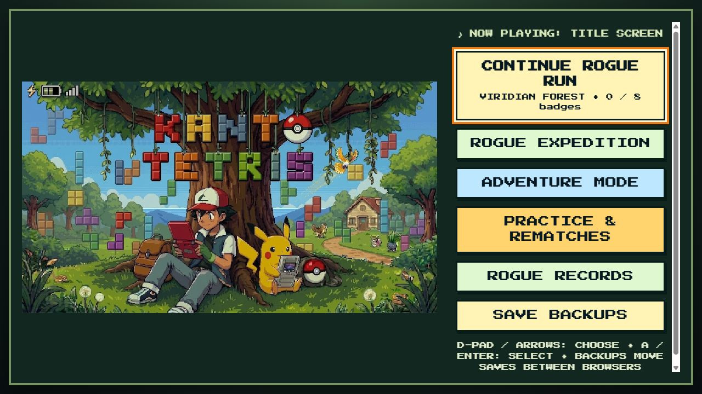

# Kanto Tetris 1.8.16

A fan-made Pokémon and Tetris adventure for Windows browsers and Android handhelds.

**[Download the latest release](https://github.com/PokemonSven/Kanto-Tetris/releases/latest)** · **[Play in your browser](https://pokemonsven.github.io/Kanto-Tetris/)** · [Release notes](RELEASE_NOTES_1.8.16.md) · [QA results](QA_RESULTS.json)

## Play

- **Windows:** download and extract the release ZIP, then open `index.html`. Keep its `music` folder alongside it.
- **Android:** install the release APK. Updates retain the existing signing identity.
- **Browser:** the GitHub Pages version uses this repository's `index.html` and `music/`.

Export a backup from **Menu → Save Backups** before updating. Browser and Android saves are separate; use the backup export/import tools to move your progress.

## Features

- Adventure with three save slots, seeded Rogue expeditions, Practice and boss rematches.
- Gym and League battles, Gary and the Champion, legendary challenges, Rocket story and Battle Tower.
- Detailed Kanto minimap and Fly map with a Pikachu location marker.
- Offline soundtrack and artwork, including the new title image.
- Keyboard and controller play, Hold, configurable repeat settings and display comfort options.
- Windows and Android layouts for 4:3 and 16:9; larger Android menus and readable party/battle panels.

## Quality checks

The release passed **2,749 checks across 98 effective suite runs**. See [the QA report](QA_REPORT.html) and [detailed results](QA_RESULTS.json) for coverage, corrected issues, and limits. Android testing used an emulator; physical Retroid hardware remains an on-device validation step.

## Development

Editable game code is in `src/`; the Android wrapper is in `android/`. Root `index.html` is the tested browser distribution, with its external audio in `music/`.

With Node.js installed, run `node tests/build-retroid-web.cjs` to regenerate the web build under `builds/Kanto_Tetris_Build_1_8_16_QA_Fixes/`. `node tests/serve-full-qa.cjs` serves isolated QA fixtures on port 4214. Keep test fixtures on a different origin from player saves, and run fixtures sequentially on a given origin.

See [Android setup and controls](android/README.md) for APK details. Building Android requires the local SDK/JDK layout expected by `android/build.ps1`; SDK binaries and signing credentials are not part of the repository. Historical packaging/verification scripts may require earlier local build artifacts. Published binaries are attached to GitHub Releases.

Earlier root helper files (`game-base.html`, `CROP_EDITOR.html`, and `classical_music.js`) are retained for historical reference; the current build is produced from `src/`.

Credits are in [CREDITS.txt](CREDITS.txt), in-game Credits, and the provenance files under `src/assets/`. This is an unofficial fan project.
